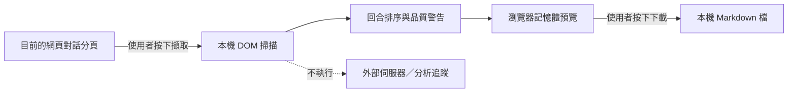

# LLM Exporter Local

> A local-only Chrome extension that exports the active ChatGPT, Grok, Claude, or Gemini conversation as portable Markdown.

把目前開啟的 ChatGPT、Grok、Claude 或 Gemini 網頁對話擷取成普通、可攜、可讀的 Markdown（`.md`）檔案。

這是一個純本機 Chrome 擴充功能：沒有後端、沒有帳號、沒有分析追蹤，也不會呼叫 OpenAI、xAI、Anthropic、Google 或任何第三方 API。擴充功能只會在使用者按下「擷取目前對話」後，暫時讀取當前支援的對話分頁並產生本機下載檔案。

目前版本：`1.3.0`。ChatGPT 與 Grok 已有實機驗證；Claude 與 Gemini 的擷取範圍對齊前兩者（主欄可見文字），仍待實機 smoke test。

## 為什麼做這個工具

平台內的對話不容易長期整理、全文搜尋或放進個人知識庫。本工具把畫面上已呈現的對話轉成普通 Markdown，且把資料處理限制在瀏覽器本機：不需 API key、不需後端，也不建立另一份雲端副本。



## 目前功能

- 支援 `chatgpt.com`、舊版 `chat.openai.com`、`grok.com`、`claude.ai` 與 `gemini.google.com`
- 保留 Human／AI 回合順序
- 轉換標題、段落、清單、引言、表格、連結與程式碼區塊為 Markdown
- 長對話先確認頂端，再逐視窗掃描到底部；可合併虛擬捲動重新掛載的回合
- 擷取後顯示回合數、角色數、邊界掃描結果與完整性警告
- 下載前可修改標題、語言與標籤
- 匯出普通 `.md`，不使用專有格式，也不建立雲端副本

## 安裝

這個版本不需要部署，也不需要架設網站。

1. 在 Chrome 開啟 `chrome://extensions/`。
2. 開啟右上角「開發人員模式」。
3. 按「載入未封裝項目」。
4. 選擇本專案內的 `extension` 資料夾。

5. 建議把 `LLM Exporter Local` 固定在 Chrome 工具列。

更完整的操作說明見 [USAGE.md](USAGE.md)。

## 開發與驗證

本專案沒有 npm 套件依賴。需要 Node.js 20 或更新版本：

```powershell
npm test
npm run check
npm run audit:public
```

修改擴充功能後，到 `chrome://extensions/` 按該卡片的重新載入按鈕。

### 已完成的驗證

- 2026-08-25：在正式 Chrome 以「載入未封裝項目」安裝並啟用成功。
- 2026-08-25：以不含識別資料的 2 回合 ChatGPT 對話完成擷取、品質檢查、下載與檔案核對；Human 1、AI 1、缺漏 0，UTF-8 中文與 Markdown 結構正常。
- 2026-08-25：以登入中的 `grok.com` 多回合對話核對現行 DOM；確認 `user-message`、`assistant-message` 與每則 `response-*` 識別碼仍可供角色辨識、排序與去重，未保存對話內容。
- 2026-08-25：以不含識別資料的 Grok 對話完成 1.1.0 端到端擷取、下載與檔案核對；4 回合（Human 2、AI 2）角色交替正確，下載檔共 200 行、10,288 bytes，`Source: Grok`、UTF-8 中文與普通 Markdown 結構正常。
- 自動測試涵蓋四家來源標記、虛擬捲動快照合併、Grok 共用容器去重、360 回合序列化、角色順序、程式碼圍欄、檔名清理、警告標記、最小權限與禁止網路請求。
- `audit:public` 會阻擋常見私密檔名、本機絕對路徑、email、私鑰標頭、憑證式 URL、常見 token 形狀，以及 Git 歷史中的非 GitHub noreply 作者地址；只回報檔名與規則，不印出疑似敏感值。

實機測試內容及下載檔不收進 repository；只記錄去識別化的驗證結果。

## 權限

Manifest V3 只宣告：

- `activeTab`：只在使用者主動操作時讀取目前分頁。
- `scripting`：把本機擷取程式注入目前的對話分頁。

未宣告網站常駐權限、cookies、storage、downloads、history 或 background service worker。

## 已知限制

- 支援的網頁結構可能改版；擷取後應查看品質警告並抽查原始對話。
- 不下載圖片或附件，只保留圖片的替代文字提示。
- 不擷取平台的隱藏推理、系統提示、Artifact／Canvas／側欄，或後端資料；只處理畫面主欄 DOM 中呈現的對話。
- 綠色「未偵測到警告」代表工具已確認掃到頂端與底部，且沒有命中現有啟發式警告；它不是逐字完整性的數學證明，重要對話仍應抽查原頁。
- 若平台改用尚未支援的 DOM 或虛擬捲動方式，極長對話可能需要重新擷取或分段保存。
- 不支援 `x.com` 裡嵌入的 Grok、Claude Desktop／CLI，或 Gemini 桌面／App。Grok 僅支援 `grok.com`；Gemini 僅支援 `gemini.google.com`。

## 授權

MIT。這是獨立實作的本機工具，不隸屬於 OpenAI、ChatGPT、xAI、Grok、Anthropic、Claude 或 Google Gemini。早期產品範圍與擷取思路曾參考 MIT 授權的 LocalThink Builder；詳見 [NOTICE](NOTICE)。
